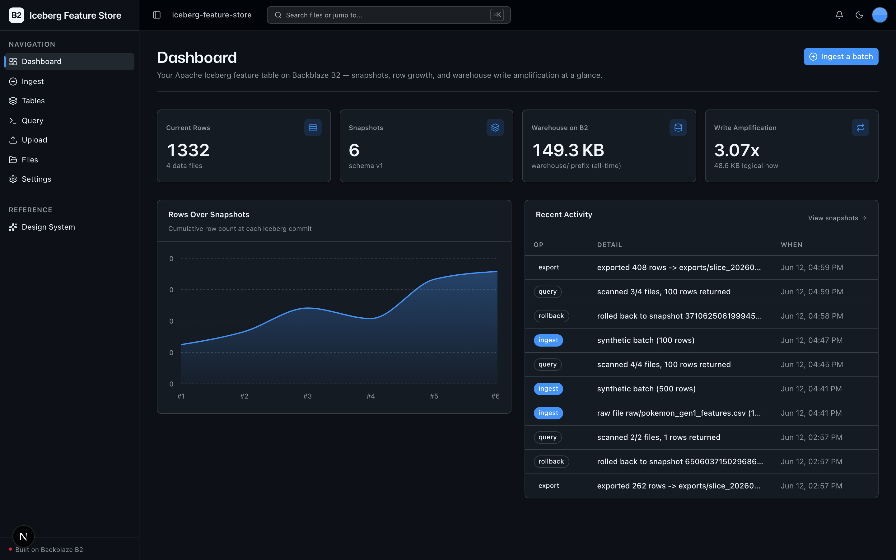
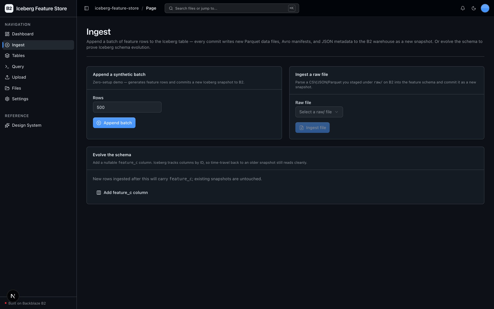
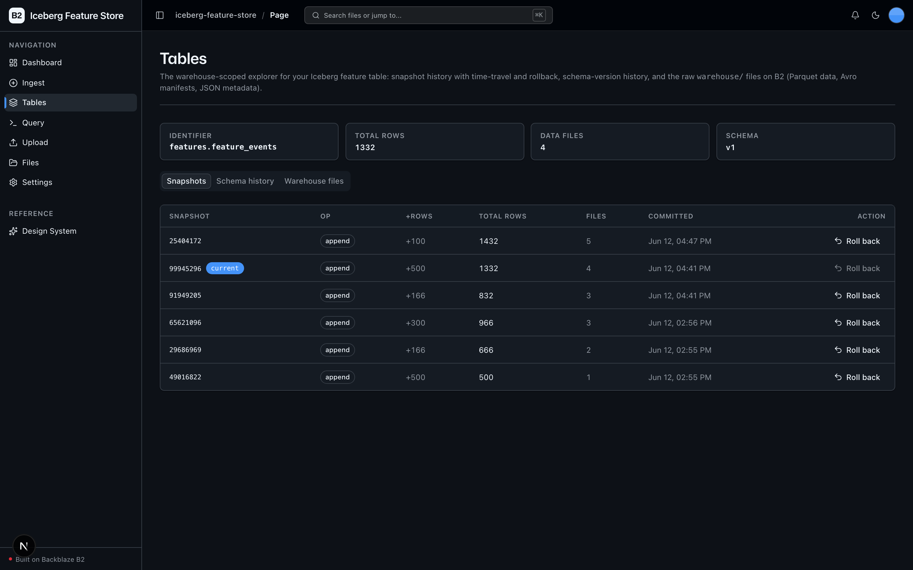
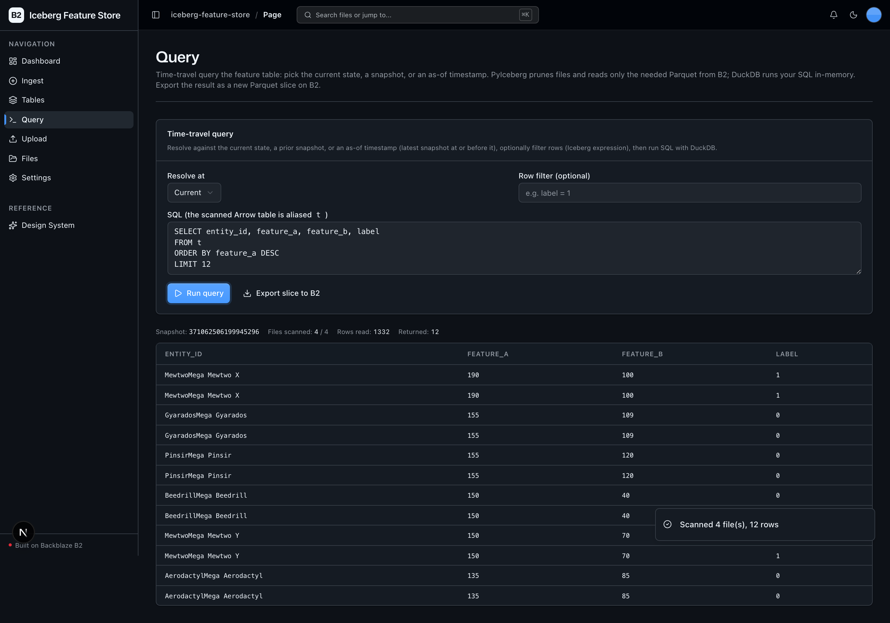

<!-- last_verified: 2026-06-12 -->
# Iceberg Feature Store

A lightweight, object-storage-native lakehouse for ML and data teams — with **no cloud data warehouse to operate**. It keeps a versioned feature table on **[Backblaze B2](https://www.backblaze.com/sign-up/ai-cloud-storage?utm_source=github&utm_medium=referral&utm_campaign=ai_artifacts&utm_content=b2ai-iceberg-feature-store)** using [Apache Iceberg](https://iceberg.apache.org) (via [PyIceberg](https://py.iceberg.apache.org)): every append, schema change, and snapshot writes new Parquet data files plus Avro manifests and JSON metadata to B2 — a continuously growing, versioned dataset with real write amplification. It **runs on your B2 credentials alone — no second API key, ~$0 per run** (B2 storage only).

Ingest batches, browse snapshots, run **time-travel queries with [DuckDB](https://duckdb.org)**, roll back to a prior version, and export a training slice as new Parquet — all resolved against the Iceberg catalog whose data, manifests, and metadata live on B2.

**This is the headline: B2 is the lakehouse storage layer, not a downstream sink.** PyIceberg reads and writes the Iceberg format directly against B2's S3-compatible API — the warehouse *is* the bucket. A tiny local SQLite "pointer" catalog tracks the latest metadata file; everything else is on B2.

**What you get out of the box:**
- A versioned **Apache Iceberg** feature table (`features.feature_events`) living entirely on B2 under `warehouse/`
- **Schema evolution** — add a column with no rewrite; time-travel back to an older snapshot still reads cleanly
- **Snapshot history + rollback** — every commit is a snapshot; roll the table pointer back in one click
- **Time-travel queries** — pick current / a snapshot / an as-of timestamp; PyIceberg prunes files, DuckDB runs your SQL in-memory
- **Export (Derive)** — write a filtered/projected training slice as a new Parquet to `exports/` (via the UA-tagged boto3 client)
- Full-stack dashboard UI (Next.js 16 + React 19 + Tailwind v4 + shadcn/ui), file upload, and a full-bucket file browser
- FastAPI backend with strict layered architecture, structural tests, JSON logging, `/health`, `/metrics`

## Who it's for

Data engineers and ML teams who want schema evolution, time-travel, and snapshot rollback over feature data — without standing up or operating a cloud data warehouse.

## What it looks like

**Dashboard** — Iceberg metrics (rows, snapshots, warehouse size on B2, write amplification), a rows-over-snapshots growth chart, and a recent-activity log.



**Ingest** — append a synthetic batch or a staged `raw/` file (each commits a snapshot), and evolve the schema by adding a nullable `feature_c` column.



**Tables** — the warehouse-scoped explorer: snapshot history with per-commit row deltas, time-travel, and one-click rollback, plus schema-version and warehouse-files sub-views.



**Query** — time-travel to current/a snapshot/an as-of timestamp; PyIceberg prunes files, DuckDB runs your SQL in-memory, and scan stats show how many files were read from B2.



## How it works

```
Ingest (synthetic batch or raw/ file)
        │  arrow batch
        ▼
  PyIceberg append ──▶ new snapshot: Parquet data + Avro manifests + JSON metadata
        │                                            (s3://<bucket>/warehouse/)
        ▼
  SqlCatalog (local SQLite pointer) ──▶ tracks latest metadata.json only
        │
  Query (current / snapshot / as-of)
        │  PyIceberg plans scan → prunes files → reads only needed Parquet from B2
        ▼
  Arrow table ──▶ DuckDB (in-memory SQL) ──▶ results + scan stats
        │
  Export ──▶ filtered/projected Arrow → Parquet bytes → exports/ on B2 (boto3, UA-tagged)
```

- **Commit atomicity is in SQLite, not S3.** The Iceberg catalog is a `SqlCatalog` backed by a tiny local SQLite DB that holds only the pointer to each table's latest `metadata.json`. Because commits are serialized through SQLite, B2's lack of conditional-PUT is a non-issue — **no `AWS_S3_ALLOW_UNSAFE_RENAME` hack needed**. Single-writer by design.
- **The warehouse is the bucket.** All table data, manifests, and metadata live under `warehouse/` on B2 via PyIceberg's PyArrow S3 FileIO. There is no warehouse server.
- **DuckDB never touches B2.** It runs purely in-memory over the Arrow table PyIceberg already read, so all B2 I/O stays in two places (boto3 + PyIceberg).

## Quick Start

You need: Node.js >= 20, pnpm >= 9, Python >= 3.11, and a free **[Backblaze B2 account](https://www.backblaze.com/sign-up/ai-cloud-storage?utm_source=github&utm_medium=referral&utm_campaign=ai_artifacts&utm_content=b2ai-iceberg-feature-store)**. No other API keys.

```bash
git clone https://github.com/backblaze-b2-samples/iceberg-feature-store.git
cd iceberg-feature-store
```

**1. Install dependencies**

```bash
pnpm install
```

**2. Set up the backend**

```bash
cd services/api
python -m venv .venv && source .venv/bin/activate
pip install -r requirements.txt
cd ../..
```

> The backend pulls in `pyiceberg[pyarrow,sql-sqlite]`, `pyarrow`, `duckdb`, and `pandas`. Everything is local OSS — no model downloads, no external services.

**3. Add your B2 credentials**

```bash
cp .env.example .env
```

Open `.env` and, from the [Backblaze B2 dashboard](https://secure.backblaze.com/b2_buckets.htm?utm_source=github&utm_medium=referral&utm_campaign=ai_artifacts&utm_content=b2ai-iceberg-feature-store):

1. **Create a bucket.** Paste each value into `.env`:
   - **Bucket Unique Name** → `B2_BUCKET_NAME`
   - **Endpoint** → `B2_ENDPOINT` (e.g. `https://s3.us-west-004.backblazeb2.com`)
   - The region segment of that endpoint → `B2_REGION` (e.g. `us-west-004`) — PyIceberg's S3 FileIO requires it explicitly.
2. **Create an application key** with `Read and Write` permission. Paste:
   - **keyID** → `B2_APPLICATION_KEY_ID`
   - **applicationKey** → `B2_APPLICATION_KEY` *(only shown once)*

> Walkthroughs: [creating a bucket](https://www.backblaze.com/docs/cloud-storage-create-and-manage-buckets?utm_source=github&utm_medium=referral&utm_campaign=ai_artifacts&utm_content=b2ai-iceberg-feature-store) and [creating app keys](https://www.backblaze.com/docs/cloud-storage-create-and-manage-app-keys?utm_source=github&utm_medium=referral&utm_campaign=ai_artifacts&utm_content=b2ai-iceberg-feature-store).

**4. Run it**

```bash
pnpm dev
```

Frontend at `localhost:3000`, API at `localhost:8000`. Then:

1. Go to **Ingest** and append a synthetic batch — this creates the table and the first snapshot on B2.
2. Go to **Tables** to see the snapshot, schema, and the raw `warehouse/` files (Parquet + Avro + JSON).
3. Append again, **Evolve the schema** (adds `feature_c`), then on **Query** pick an older snapshot and time-travel.
4. Run a SQL query, then **Export slice to B2** to write a Parquet to `exports/`.

`pnpm dev` runs `pnpm doctor` first — a preflight check for the common setup gotchas (Node/Python version, missing venv, missing or placeholder `.env`, busy ports).

## Core Features

- [Iceberg Warehouse on B2](docs/features/iceberg-warehouse.md) — the SqlCatalog pointer + warehouse on B2, why no unsafe-rename is needed, the UA deviation
- [Batch Ingestion & Schema Evolution](docs/features/ingestion.md) — synthetic / raw-file append; add a nullable column with no rewrite
- [Snapshots & Time Travel](docs/features/snapshots-time-travel.md) — snapshot history, schema versions, rollback, the warehouse-files sub-view
- [Time-Travel Query & Export](docs/features/query-export.md) — file-pruning scan + DuckDB SQL + scan stats; export a Parquet slice (Derive)
- [Raw Batch Staging (Upload)](docs/features/file-upload.md) — drag-and-drop CSV/JSON/Parquet into `raw/`
- [File Browser](docs/features/file-browser.md) — full-bucket browse / preview / download / delete
- [Metadata Extraction](docs/features/metadata-extraction.md) — image dimensions, EXIF, PDF info, checksums
- [Dashboard](docs/features/dashboard.md) — Iceberg metrics, rows-over-snapshots chart, recent activity
- [Design System](docs/design-system.md) — tokens, primitives, loader, error/empty states. Live preview at `/design`.

## B2 Surface (S3-compatible API only)

All B2 access uses the **S3-compatible API** — no b2-native API anywhere.

- **boto3 client** (`services/api/app/repo/b2_client.py`, user agent `b2ai-iceberg-feature-store`, `region_name=B2_REGION`): `head_bucket`, `put_object` (raw uploads **and export Parquet writes**, so Derive writes are UA-tagged), `list_objects_v2` (bucket / warehouse / exports / raw browse + sizing), `get_object`, `head_object`, `generate_presigned_url`, `delete_object`.
- **PyIceberg PyArrow S3 FileIO** (`warehouse/` prefix): GET/PUT/LIST/HEAD of Parquet data files, Avro manifests, and `metadata.json` — for append, schema evolution, snapshot listing, time-travel scans, and rollback.
- **DuckDB** runs purely in-memory over the Arrow table PyIceberg returns — **no DuckDB S3 access**.

One documented B2 specific: a custom-UA deviation on PyIceberg's internal PyArrow S3 client (it exposes no UA override through PyIceberg's public API). The boto3 client is fully UA-tagged. Explained in [ARCHITECTURE.md](ARCHITECTURE.md).

## Tech Stack

- TypeScript, Next.js 16, React 19, Tailwind v4, shadcn/ui, Recharts
- TanStack Query — caching, dedup, retry, stale-while-revalidate for every fetch
- Python 3.11+, FastAPI, boto3, Pydantic v2, **PyIceberg, PyArrow, DuckDB, pandas**
- Backblaze B2 (S3-compatible object storage) — the warehouse storage layer
- pnpm workspaces (monorepo)

## Commands

| Command | What it does |
|---------|-------------|
| `pnpm dev` | Start frontend + backend |
| `pnpm dev:web` | Frontend only |
| `pnpm dev:api` | Backend only |
| `pnpm build` | Build frontend |
| `pnpm lint` | Lint frontend |
| `pnpm lint:api` | Lint backend (ruff) |
| `pnpm test:api` | Run backend tests |
| `pnpm check:structure` | Verify layering rules |
| `pnpm test:e2e` | Playwright e2e tests (run `pnpm --filter @iceberg-feature-store/web exec playwright install chromium` once first) |

## Documentation Map

| Doc | Purpose |
|-----|---------|
| [AGENTS.md](AGENTS.md) | Agent table of contents — start here |
| [ARCHITECTURE.md](ARCHITECTURE.md) | System layout, layering, data flows, the catalog/warehouse model |
| [docs/features/](docs/features/) | Feature docs (warehouse, ingestion, snapshots, query/export, upload, browser, metadata, dashboard) |
| [docs/design-system.md](docs/design-system.md) | Design tokens, primitives, loader, error/empty states |
| [docs/app-workflows.md](docs/app-workflows.md) | User journeys |
| [docs/dev-workflows.md](docs/dev-workflows.md) | Engineering workflows and testing |
| [docs/SECURITY.md](docs/SECURITY.md) | Security principles |
| [docs/RELIABILITY.md](docs/RELIABILITY.md) | Reliability expectations (single-writer catalog, rollback semantics, orphan files) |
| [docs/exec-plans/](docs/exec-plans/) | Execution plans and tech debt tracker |

## Contributing

Start with [AGENTS.md](AGENTS.md). It's the map — everything else is discoverable from there.

## License

MIT License - see [LICENSE](LICENSE) for details.

## Claude Agent B2 Skill

Manage Backblaze B2 from your terminal using natural language (list/search, audits, stale or large file detection, security checks, safe cleanup).

Repo: [https://github.com/backblaze-b2-samples/claude-skill-b2-cloud-storage](https://github.com/backblaze-b2-samples/claude-skill-b2-cloud-storage)
